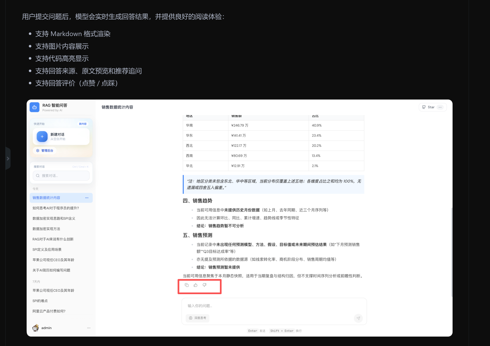

图计算

实体对齐、本本对齐
https://mp.weixin.qq.com/s/Gckxu2SboorLQgrx-A8FGw

实体属性补全

图嵌入，又称Graph Embedding(GE，Network Embedding)，

把这个系统的功能暴露成技能skill，智能体可引用这个skill,再加个智能体小助手浮窗，在系统任务位置有不会用的功能都可以直接点击小助手浮窗的技能来问答或直接操作

Action对应这个系统里哪个功能

多智能体协作

智能体记忆、状态、工具管理

# RAG
    知识库回答后可以加个人工评分，完善召回时体验，也让模型学习到这个知识库的回答质量

    

# 系统监控
    加上rerank模型

# 工作流
工作流加本体类别区分
工作流如何接入kafka等消息数据

# 长期
本项目本体类别只有一层，palantir的Object type是多层的

# 文档
把所有表整理下，写一下注释和说明

# 模型微调

# 其他
Harness、多 Agent 设计、自动化评测、Bert意图识别这些都要看看

skills概念、组成
MCP

有丰富高并发系统架构设计与性能调优经验等，分布式事务、分布式锁、限流熔断、降级容错、高并发架构、系统稳定性治理