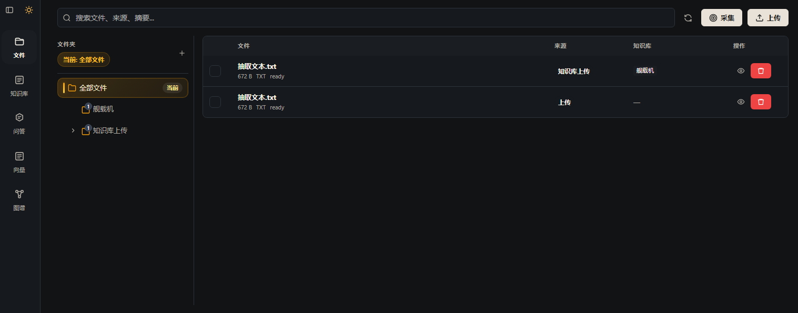

目前这个系统有以下几个菜单

主要功能及架构见：：backend\ARCHITECTURE.md
通过向知识库中上传文件形成知识库中的实体和关系，形成图谱；

现在在抽取实体和关系时，没有本体和关系约束，每次抽取出来的实体和关系可能都不一样，随机的。
现在想增加一个功能，用户可以在抽取实体和关系时，指定本体和关系，这样抽取出来的实体和关系就会符合用户的约束。
1、在当前系统上增加本体管理、本体关系管理功能，这2个功能直接在现有Python后端中实现
设计下上面架构，形成一个开发设计文档，放在doc目录下，先不开发，等我确认
   

本体管理部分再优化下，应该是本体类别、本体管理：可以给本体添加多个属性，然后是本体关系定义：相当于一个关系字典，再是本体关系设置，选择起点、终点2个本体和关系，组成三元组，这样可以吗，重新 设计下