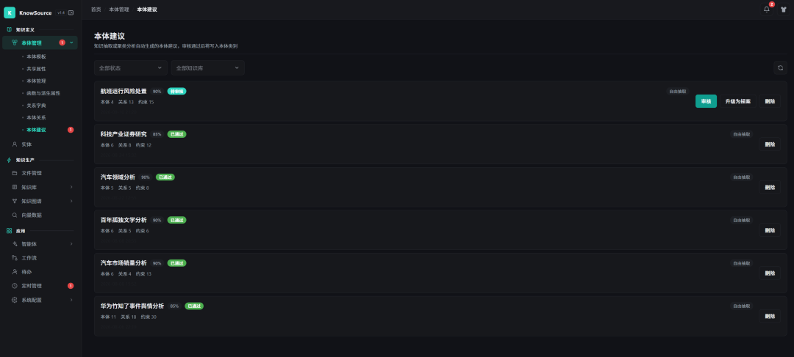
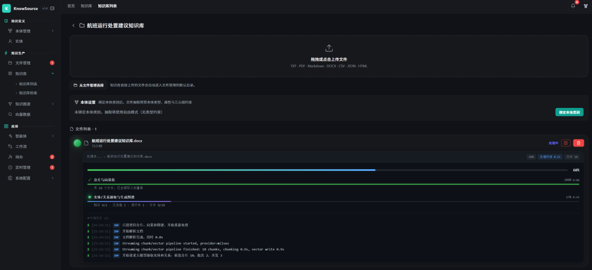
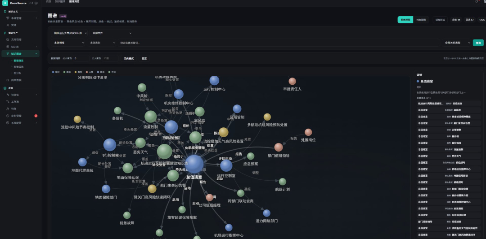
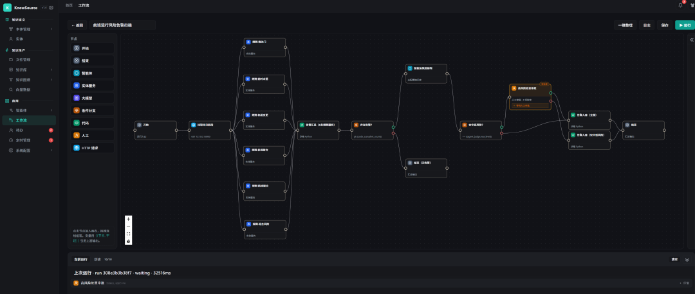
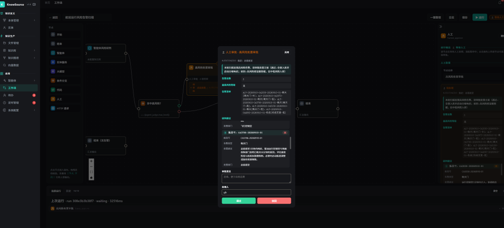

# KnowSource 业务功能说明

> 本文档随功能迭代持续更新，新增功能追加到对应分组。最后更新：2026-09-10。

## 一、产品概述

KnowSource 是一套基于知识库的轻量级 RAG（检索增强生成）问答系统，并逐步扩展出知识图谱、智能体、工作流、定时调度等能力。

左侧菜单按"**知识定义 → 知识生产 → 应用**"的闭环组织为三大分组：

1. **知识定义**：先把知识的结构和数据标准定好（本体类别、本体/类型、属性、关系、接口），以及沉淀下来的实体。
2. **知识生产**：把文件/资料变成可检索的知识（知识库、向量、图谱），并进行图分析与清洗。
3. **应用**：用智能体、工作流、定时任务把知识用起来，并提供系统配置与监控。

菜单结构示意：


---

## 二、知识定义

### 2.1 本体管理（本体类别下）

本体管理是"定义知识结构"的核心，包含 7 个子菜单，分别覆盖**属性复用**、**类型定义**、**函数与派生属性**、**关系与约束**、**智能建议**五块。

#### 本体模板（`属性模板`）

- **菜单路径**：本体管理 → 本体模板
- **作用**：维护一组可复用的「属性套餐」（如"人员基础信息"模板内含姓名、性别、出生日期等多个属性）。
- **怎么用**：在「本体编辑」页把某个模板**绑定**到本体，系统会把这些属性**合并**进本体（运行时动态合并，模板属性更新后所有绑定的本体同步生效；本体自身同名属性优先覆盖模板属性）。
- **适用场景**：同类本体都要补齐同一批常规范畴时，一次绑定、批量建档，避免重复录入。

#### 共享属性

- **菜单路径**：本体管理 → 共享属性
- **作用**：维护**单个属性**的统一定义（编码 code、数据类型、单位、格式化规则、渲染提示）。它是属性的「单一事实来源」。
- **怎么用**：在「本体编辑 → 属性」里，把某个属性**绑定**到共享属性，绑定后该属性的编码/类型/单位/格式会锁定跟随共享定义，改一处所有引用它的本体同步生效。
- **适用场景**：跨本体需要"同一口径"的关键字段（如"金额""时间""地点"），保证不同本体里同名属性编码一致、单位一致、格式一致。共享属性也是**接口（Interface）契约的组成单元**（见 2.1.6 接口实现）。

##### 挂载到本体（「挂到本体」操作说明）

在共享属性列表点「**挂到本体**」，即可把该属性批量挂到多个本体上，整个流程分三步：

**第一步：勾选目标本体**

弹窗左侧是按类别分组的本体树，支持逐个勾选或整类全选。**再次打开弹窗时，已挂载该共享属性的本体会自动勾选并显示「已挂载」标记（回显）**，可直接增删调整；底部「同步已有同名属性」选项控制是否用共享定义覆盖已存在的同名属性（类型/必填/默认值并绑定引用）。


**第二步：确认挂载 / 取消挂载（核对弹窗）**

点「应用」后系统先做预检，弹出核对弹窗，把有风险的项目列出来让用户确认：

- **同名提示（挂载侧）**：列出已存在**同名手工属性**的本体，提示这些本体挂载时**仅绑定引用、不覆盖其定义**（除非勾选了「同步已有」）。
- **删除选择（取消侧）**：取消勾选的本体将**取消挂载**，逐个显示属性来源标签——
  - 「**由共享属性生成**」的属性：**默认删除**；
  - 「**手工创建同名**」的属性：**默认仅解绑保留**，可按需勾选「同时删除该属性」。


**第三步：应用并查看结果**

确认后执行挂载/取消挂载，完成后提示「应用完成：新建属性 X 处，Y 处已同步，Z 处已绑定，W 处已取消挂载」（无变化时提示「无变更」），列表的「引用」计数同步刷新。


**规则速查**

| 场景 | 行为 |
|---|---|
| 目标本体无同名属性 | 新建属性并自动绑定该共享属性（标记为"由共享属性生成"） |
| 目标本体已有同名属性 | 默认仅绑定引用、不覆盖定义；勾选「同步已有」后覆盖类型/必填/默认值 |
| 取消勾选已挂载本体 | 取消挂载：生成类属性默认删除，手工同名属性默认解绑保留（可勾选一并删除） |
| 全部取消勾选 | 允许空选择提交，即解除全部挂载 |
| 删除共享属性本身 | 引用它的本体属性保留，仅解除引用 |

> 注意：历史数据中已挂载的属性默认视为"手工创建"，取消挂载时只解绑、不删除，避免误删用户手工创建的属性；只有挂载时**新建**的属性才标记为"由共享属性生成"并在取消挂载时默认删除。


#### 📌 本体模板 vs 共享属性：区别在哪？

两者都能让本体"拥有"更多属性，但**复用粒度与语义完全不同**：

| 维度 | 本体模板（属性模板） | 共享属性 |
|---|---|---|
| **复用粒度** | 一组属性打包（套餐） | 单个属性（食材） |
| **绑定方式** | 在「绑定模板」处一次性引入整组 | 在编辑单个属性时选择绑定某一个 |
| **语义定位** | 建类脚手架：快速给同类本体补齐常规范畴 | 跨类型契约：锁定关键字段的统一口径 |
| **与接口关系** | 无关 | 是接口的组成单元，接口实现依赖它 |
| **能否只复用部分** | 整组引入，不能只取其中一个 | 可以按属性逐个绑定，灵活选取 |
| **典型比喻** | 餐厅套餐（前菜+主菜+甜点一起上） | 标准化食材（同一种面粉，做哪个菜都用同一规格） |

一句话总结：**模板解决"批量建档快"，共享属性解决"关键字段口径统一、并支撑接口契约"**。实践中两者可组合：先用模板快速建档，再把其中需要统一口径的关键属性升级绑定为共享属性。

#### 本体管理

- **菜单路径**：本体管理 → 本体管理
- **作用**：本体类别（Ontology Category）的管理入口，按分类维度组织本体。
- **怎么用**：选择某类别查看其下本体列表，进入「本体编辑器」维护某一具体本体（基础信息、属性、绑定模板、配置服务、实现接口）。
- **本体编辑器（OntologyEditor）是核心编辑页**，包含：
  - **基础信息**：名称、编码（API 名）、显示名、复数名、图标、生命周期状态（草稿/活跃/弃用）、分组、标题属性。
  - **属性**：维护本体自有属性；支持绑定共享属性（锁定类型/单位/格式）；支持"仅人工编辑"属性（不参与 LLM 自动抽取，只人工维护）。属性列表按「**固有 / 继承（模板）/ 派生 / 自有**」分层展示，前三类只读（继承=橙色标记、派生=紫色标记），详见下文"航段本体示例"。
  - **绑定属性模板**：批量引入模板属性，并预览合并后的完整属性集。
  - **本体服务（动作）**：挂载 Python 动作（详见 4.6 本体/实体服务编辑器）。
  - **接口实现**：把本体挂到共享接口上，并配置属性映射（详见下文"接口实现"）。

#### 函数与派生属性（只读函数 + 派生属性）

- **菜单路径**：本体管理 → 函数与派生属性
- **作用**：在本体层面沉淀"只读计算能力"，包含两类：
  - **函数**：一段在沙箱子进程里运行的 Python 只读计算（`def run(params, entity, context)`），只算不写、可缓存。例：机龄计算、综合评分、单位换算。
  - **派生属性**：挂在某"本体"上的计算型属性。它不像普通属性那样来自抽取或人工录入，而是由"函数"或"图指标"运行时算出来——等于把一段算法封装成本体的一项标准属性。例：某飞机的"机龄"、某实体的"度数 / PageRank"。
- **怎么用**：
  - **函数编辑**：填写名称、编码、描述；在参数面板定义 `params_schema`（参数模式）；在 Python 编辑器中按契约编写 `def run(params, entity, context)`。
  - **缓存字段**：下拉选择"缓存"或"不缓存"。选择"缓存"表示函数幂等、无副用、相同输入必得相同输出，系统会对结果做 TTL 缓存；选择"不缓存"表示每次调用都重新执行，适用于依赖外部 API、随机数、当前时间等场景。
  - **缓存(秒)**：仅对"缓存"函数生效，设置结果缓存有效期；计算成本高、调用频繁的函数建议设置（如 `300` 秒），命中缓存即跳过执行。
  - **超时(秒，1-120)**：函数在沙箱子进程中的最大运行时间，超时被强制 kill。
  - **测试运行**：填写 `params` JSON 与可选的 `mock_entity`，验证函数输出。
  - **派生属性**：来源选"函数"时绑定一个函数并传参；选"图指标"时选择指标（degree / pagerank / betweenness / community），系统从最近的图分析任务结果回填。刷新策略可选"读时计算（virtual，每次读取实时算）"或"物化（materialized，把结果写入实体属性）"。
  - **物化**：对派生属性点「物化」，把当前值批量写入 `entities.properties`（键 = 派生属性 code）；物化后它在实体详情、检索、视图里就和本体普通属性一样可见、可筛选。
- **派生属性解决了什么问题**：普通属性靠抽取/人工得到"已知事实"；但很多有价值的量（机龄、评分、度数）需要"用已知事实再算一步"。派生属性让这类"算出来的属性"也能成为本体的标准字段，统一口径、可复用、可缓存，且不必每次在前端手算。
- **在哪用（函数的复用入口）**：
  1. 被**派生属性**直接复用——函数型派生属性的计算内核就是一个函数。
  2. **实体调用**：在实体上按 code 调用函数（API：`POST /entities/{id}/functions/{fid}/invoke`），按需对单个实体求值。
  3. **批量解析**：一次对对象集 / 视图的多实体求值（`POST /functions/resolve`），供列表或视图聚合展示。
  4. （设计上）作为统一的只读计算底座，可被动作、智能体、工作流节点复用。
- **在哪用（派生属性的消费入口）**：
  1. **实体详情页**：读取该实体在本体下所有派生属性的当前值（读时计算模式按需求值）。
  2. **物化入库后**：写入实体属性，可在实体详情、检索、图谱 / 视图中像普通属性一样查看、排序、筛选。
  3. **图指标型**：先到「知识生产 → 知识图谱 → 图分析 → 计算任务」提交算法（PageRank / 度数等），跑完後图指标型派生属性即可回填到对应实体。
- **函数 / 派生属性 / 动作 的区别**：函数只"算"不"写"；派生属性把"算出来的结果"变成本体的一项属性；动作（本体 / 实体服务）是"写"操作，可触发业务副作用。

##### ✦ AI 辅助编写函数代码（流式生成 + 参数自动同步）

- **入口**：函数编辑器代码区右上角「✦ AI 辅助」按钮，展开右侧对话面板（前置条件：系统配置中已配置并激活 LLM）。
- **流式返回**：用自然语言描述需求（如"接收一个数值列表，返回它们的和"），AI 通过 SSE 流式逐字返回：先给「实现说明」，再给完整 Python 代码，最后附参数定义 JSON。生成过程中实时上屏，回复完可继续追问迭代修改。
- **一键应用 + 参数自动同步**：点「应用到编辑器」后，代码写入编辑器，同时**以 AI 解析出的参数为准自动同步参数表**——新增 AI 识别出的参数（名称/类型/必填/说明一并带入），不再使用的旧参数被替换，AI 返回的类型自动归一到 string / number / boolean / object，无需手动逐个录入。应用后点「保存」才真正生效。
- **安全边界**：AI 生成内容只写入编辑器草稿、不直接落库；保存后函数仍在沙箱子进程中执行，继续受静态安全校验与只读上下文约束。


##### ✦ 示例：民航航班运行监控（航段本体的属性分层与派生属性）

以「民航航班运行监控」场景为例（可用 `backend/scripts/seed_flight_ops_runtime.py` 一键生成演示数据），看属性的三种来源如何在一个本体上协同工作。

**航段本体的属性分层**（本体编辑器 → 本体属性 tab，共 18 项）：

| 分层 | 属性 | 说明 |
|---|---|---|
| **固有** | `name` 名称 | 系统固有标识，用于实体列表 / 详情卡片显示，不可编辑 |
| **继承（模板）** | `data_source` 数据来源、`updated_at` 更新时间、`confidence` 可信级别 | 来自绑定的「监控数据溯源属性」模板，运行时动态合并；只读展示（橙色「继承」标记），到「本体模板」里统一维护 |
| **派生** | `flight_duration_min` 预计飞行时长、`etd_delay_min` 预计起飞延误、`eta_delay_min` 预计到达延误、`leg_phase` 当前运行阶段 | 运行时由函数实时计算、无存储值；只读展示（紫色「派生」标记），到「函数与派生属性」页维护 |
| **自有（可编辑）** | `leg_no` 航段号、`flight_no` 航班号、`flight_date` 航班日期、`dep_airport` 出发机场、`arr_airport` 到达机场、`sobt` 计划撤轮档时间、`sibt` 计划挡轮档时间、`etd` 预计撤轮档时间、`eta` 预计挡轮档时间、`aobt`/`atot`/`aldt`/`aibt` 实际 OOOI 里程碑时间、`leg_status` 当前状态、`cruise_altitude` 巡航高度 等 | 常规可编辑属性，来自抽取或人工录入，可增删改、参与保存 |


**派生属性清单**（函数与派生属性页，均为"函数来源 + 读时计算 + 缓存"）：

| 名称 | 编码 | 类型 | 计算逻辑 |
|---|---|---|---|
| 预计飞行时长 | `flight_duration_min` | number | ETA − ETD（分钟）；预计时间缺失时回退计划时间 SOBT/SIBT |
| 预计起飞延误 | `etd_delay_min` | number | ETD − SOBT（分钟），正值晚于计划；无滚动预计按正点 0 计 |
| 预计到达延误 | `eta_delay_min` | number | ETA − SIBT（分钟），正值晚于计划；无滚动预计按正点 0 计 |
| 当前运行阶段 | `leg_phase` | string | 按当前时刻与 ETD/AOBT/ATOT/ALDT/AIBT 推断：计划中/地面保障/待撤轮档/已撤轮档/空中飞行/落地滑入/已到达 |

这个例子体现了三层的分工：**模板**补齐监控数据的通用溯源字段、**派生属性**把"算出来的运行态势"变成标准字段、**自有属性**承载业务事实——三者在本体属性列表中分层呈现、互不干扰。

#### 关系字典

- **菜单路径**：本体管理 → 关系字典
- **作用**：维护知识抽取与图谱中使用的关系类型定义（如"任职于""持有""位于"），是关系抽取的统一词表。
- **怎么用**：新增/编辑/删除关系类型，供抽取服务与约束引用。

#### 本体关系（约束）

- **菜单路径**：本体管理 → 本体关系
- **作用**：定义三元组约束规则（源本体—关系→目标本体），约束 LLM 抽取时的合法关系组合。
- **怎么用**：配置"人物—任职于→组织"之类的约束，抽取阶段会按此过滤/规整，提升图谱质量。

#### 本体建议

- **菜单路径**：本体管理 → 本体建议
- **作用**：展示由「自由抽取 + 自动聚类」产生的本体/关系/约束建议（含数量与置信度），支撑"建议→审核→入库"的闭环。
- **怎么用**：按状态/知识库筛选，逐条审核（采纳为本体、关系或约束，或删除），把建议沉淀为正式定义。



##### 「升级为提案」是什么？

每条待审核建议有**两条入库路径**，对应两种变更严肃程度：

| | 直接「审核」采纳 | 「升级为提案」 |
|---|---|---|
| 定位 | 快速入库：逐条采纳为本体/关系/约束 | 整包建议升级为「**变更提案**」，进入提案审查流程 |
| 数据变化 | 建议内容直接写入本体定义 | 标记为变更提案，记录基于的类别版本号、变更项、审核人 |
| 生效方式 | 采纳即生效 | 点「**合并并打版本**」时才应用到本体类别 |
| 可追溯/可回滚 | 无版本记录 | **合并时自动生成版本快照**，合并后可回滚 |

流程：待审核建议 → 点「升级为提案」（进入提案审查流程）→ 卡片出现「变更提案」徽标，按钮变为「合并并打版本」→ 合并时把变更一次性应用至绑定的本体类别并自动创建新版本，之后可在版本管理中回滚。适合"影响面大、需要正式审查留痕"的批量结构变更；小修补直接走「审核」即可。

#### 接口管理（接口编辑器）

- **菜单路径**：本体管理 → 接口
- **作用**：定义可被多个本体共享的「接口契约」——一组对外一致的属性（及接口链接），让不同本体能被同一份视图/动作/函数统一处理（多态）。
- **接口属性里的「共享属性」列**：把某个接口属性挂到全局共享属性上。**挂上后，本体实现该接口时若其属性也引用同一共享属性，系统会自动建立映射，无需逐本体手动配置**；否则实现时需在本体编辑器里逐个手动映射。

  下图展示了在接口编辑器里把接口属性「描述」挂到共享属性「描述」：

  

  对应地，在本体编辑器里实现该接口时，若本体的「描述」属性也引用了同一共享属性，系统会自动把它映射到接口属性「描述」，无需手动选择：

  
- **怎么用**：
  - 新增/编辑接口：填写名称、编码、类型（如 polymorphic 多态）、描述。
  - 编辑「接口属性」：逐条添加属性（名/编码/类型/必填），并在「共享属性」列选择对应的共享属性（可与「共享属性」菜单里的定义对齐，保证跨接口口径一致）。
  - 在「实现情况」里为接口挂接本体并维护属性映射（详见下方"接口实现"）。

#### 接口实现（本体编辑器内）

- **所在位置**：本体编辑器 → 接口实现区（需后端开启接口能力）
- **作用**：让一个本体**实现**某个共享接口，从而被"同一份视图/动作/函数"统一处理（多态）。接口由若干共享属性 + 接口链接构成，本体需把自身属性**映射**到接口属性。
- **怎么用**：
  - 列出当前类别下的全部接口；未实现的显示「实现…」按钮。
  - 点击「实现…/调整映射」展开映射编辑器：接口的每个属性对应本体的一个自有属性（同名的自动匹配；若接口属性已挂共享属性、且本体属性也引用同一共享属性，则自动识别映射）。
  - 保存时校验缺失与类型不匹配，提示哪些接口属性未映射（必填项未映射会标记为「部分映射」）。
  - 实现状态显示「完整映射 / 部分映射（缺失或类型不符）」，可「解除」实现。

#### 对象视图（本体管理详情 tab）

- **菜单路径**：本体管理 → 选中类别 → 对象视图
- **作用**：用 JSON 配置**实体详情页**的渲染布局（`tabs → sections → widgets`），让不同本体按业务需要组织信息。没有匹配视图时，实体详情页自动回落到默认固定布局。
- **怎么用**：
  - **新建/编辑视图**：填写视图名称，选择绑定范围，编辑布局 JSON。
  - **绑定范围（三选一）**：
    - **类别缺省**：不填「绑定本体 ID」和「接口 code」，作为该类别下所有本体的默认视图。
    - **本体级**：填写某个 `ontology_id`，仅对该本体生效，优先级最高。
    - **接口级**：填写某个接口 `interface_code`，该接口所有实现本体统一使用此视图。
  - **设为默认**：同一绑定范围内只能有一个默认视图，点击「设为默认」后其他同范围视图会自动取消默认。
  - **布局 JSON 结构**：
    ```json
    {
      "tabs": [
        {
          "name": "概览",
          "sections": [
            {
              "title": "基本信息",
              "widgets": [
                { "kind": "properties", "title": "属性", "config": {} },
                { "kind": "relations", "title": "关系", "config": {} }
              ]
            }
          ]
        }
      ]
    }
    ```
  - **可用微件 kind**：
    - `properties`：属性面板
    - `relations`：关系（三元组）面板
    - `actions`：可用动作/服务面板
    - `derived`：派生属性面板
    - `timeline`：时间线
    - `chart`：图表
- **在哪生效**：实体详情页加载时，后端按「本体级默认 → 类别缺省默认」解析出应使用的视图；接口级视图可在实现接口的本体上生效（解析规则由后端按绑定优先级返回）。

#### 影响分析（本体管理详情 tab）

- **菜单路径**：本体管理 → 选中类别 → 影响分析
- **作用**：**删除 / 改名前的安全预检**。选定一个本体后，分析这个本体在整个系统里被哪些地方"用到"，把影响面一次性列出来，避免改/删后下游对象全断。
- **怎么用**：选本体 → 点「分析」→ 顶部出现 8 个计数标签（`hot` 样式 = 有依赖），下方分块列出具体依赖项。
- **指标含义**：
  - **三元组约束**：本体关系（约束）里以它为源/目标的规则数；
  - **实体**：当前本体下的实体实例数；
  - **接口实现**：哪些接口挂了这个本体（多态查询会用到）；
  - **动作**：本体服务里绑定该本体的动作数；
  - **函数**：函数库中引用该本体的函数数；
  - **派生属性**：派生属性中以它为来源的项数；
  - **对象视图**：实体详情页视图里引用该本体的项数；
  - **KB 绑定**：把它作为抽取约束的知识库数。
- **何时用**：
  1. **删本体前**：看「实体」「KB 绑定」就知道会连累多少数据。
  2. **改编码/名称前**：确认依赖它的接口、视图、KB 引用了哪个 code，避免改完下游全断。
  3. **重构评估**：快速判断该本体在系统里有多"重"。
- **安全信号**：所有标签都无 `hot` 高亮、且下方提示「该本体暂无其他对象依赖」时，可放心删除 / 改名。

### 2.2 实体

- **菜单路径**：知识定义 → 实体（实体管理）
- **作用**：管理由抽取/导入产生的具体实例（Object）。
- **怎么用**：
  - **实体列表**：按本体树筛选、搜索、分页、新建（填本体/类型/名称/属性 JSON）/删除。
  - **实体详情**：查看与编辑名称、描述、属性；预览关联文件与命中高亮；管理该实体的「实体服务」（动作）调用、复制为自定义、新增/编辑/删除。
  - **关系实例**：以"源实体—关系→目标实体"查看抽取出的三元组，支持搜索、分页、删除（同步删除图谱边）。

---

## 三、知识生产

### 3.1 文件管理

- **菜单路径**：知识生产 → 文件管理
- **作用**：文件与资料资产统一管理。
- **怎么用**：目录树 + 分片上传、网络爬取（采集任务）、文件预览/编辑、批量选择，并把资产**挂载（attach）到指定知识库**进入处理流程。

### 3.2 知识库

- **知识库列表**：按名称/状态（就绪/处理中/异常/待处理）搜索筛选、分页、新建/编辑/删除、批量删除。
- **知识库详情**：上传文件并观察「分片 → 向量化 → 抽取」三阶段进度；重处理/取消；**绑定本体类别**（决定抽取约束）；查看待审核的本体建议。
- **知识库检索**：面向知识库的 RAG 问答。提供 `rag` / `agent` 两种模式，SSE 流式回答、引用来源分片高亮、智能体模式下的图谱推理过程与种子实体展示，并支持技能选择。

#### 知识库详情页：文件处理实况

详情页自上而下分为四块，文件处理全程可视：

- **上传区**：拖拽或点击上传文件（支持 TXT / PDF / Markdown / DOCX / CSV / JSON / HTML），也可从「文件管理」直接挂载已有资产。
- **本体设置**：为知识库**绑定本体类别**——绑定后文件抽取将优先按该类别的类型、属性与三元组约束进行；未绑定时走自由模式（无类型约束）。
- **文件列表**：展示文件名、大小、处理状态（就绪/处理中/异常/待处理），单个文件可重处理/取消/删除。
- **处理进度与实时日志**：每个文件按「**分片与向量化 → 本体/实体抽取与图谱生成**」阶段展示进度条（含 chunk 数、队列已完成/进行中/待办计数），下方日志面板按时间流式输出后台处理明细（如 milvus 写入 chunk 数、实体关系抽取轮询进度），长任务处理不再黑盒。



#### 分片策略确认（处理前决策）

文件分析完成后不会直接入库，而是先弹出**策略确认框**：展示文档分析结果与系统推荐，确认后再执行分片，避免"一刀切"的默认参数导致检索质量不稳定。

**流程**：上传 → 自动分析（状态「分析中」→「待确认」）→ 点「确认策略」→ 在确认框中调整 → 开始处理（状态转为「处理中」）。

- **推荐卡片**：展示推荐策略、置信度与判断理由（如"检测到 42 个标题、最深 3 级，按章节层级切分可保留结构"）。理由来自文档特征分析：标题数量与层级深度、段落/句子长度分布、列表与表格占比、代码块占比、语义突变密度（可选抽样，默认关闭）、文件类型（CSV/JSON 走记录边界策略）。
- **策略下拉**：可覆盖推荐结果，切换策略时自动带入该策略的建议参数。
- **上限参数**：滑块标签按策略语义命名（见下表），拖动后自动重算预览。
- **实时预览**：不落库的 dry-run，展示前 5 块内容、预计总块数与平均块长度，可直接对比不同策略/参数的切分效果。
- **批量处理**：不提供手动选择，自动采用每个文件的分析推荐（未分析的文件使用全局默认策略）。
- **决策留痕**：确认结果写入文件的 `chunking_decision`，记录 `strategy` / `params` / `decided_by`（`user` = 用户确认，`auto` = 采用推荐或默认），处理日志同步打印，便于回溯。

**五种策略对照**：

| 策略 | 适用场景 | 上限参数（滑块标签） | 重叠 | 上限是否严格 |
| --- | --- | --- | --- | --- |
| 固定长度切分 | 数据类、日志类文本，追求块大小均匀 | 块大小 | 支持 | 是：超出部分按分隔符回退，无分隔符时按字符硬切 |
| 句子/段落切分 | 正文类文档，要求语义边界完整 | 累积上限 | 不支持（推荐值恒为 0） | 否：单个超长句子不切分，可能超过该值 |
| 递归字符切分 | 通用默认，按结构逐级降级 | 目标块大小 | 支持 | 是：可降级到字符级 |
| 语义切分 | 话题切换频繁的长文档，要求单块主题聚焦 | 聚合上限 | 不支持 | 否：单个超长句子不切分，可能超过该值 |
| 层级/标题切分 | 教材、手册、带目录的规范文档 | 章节上限 | 不支持 | 否：单节超限时按句子递归细分 |

**补充说明**：

- **重叠只给「固定长度」与「递归字符」**：句子/段落切分为保持语义边界完整不宜重叠（推荐值恒为 0）；语义切分与层级切分的执行器不消费重叠，给出也不会生效。
- **各策略的上限语义不同**：固定长度是滑动窗口硬切上限；句子/段落是句子累积阈值；递归是逐级降级的目标块大小；语义是相邻段落聚合阈值；层级是单节细分与小节合并的阈值。界面按策略显示对应标签与含义说明，避免一律写成"块大小"造成误解。
- **全局兜底**：文件未分析（分析失败或跳过）时不弹确认框，直接使用全局默认策略（`config.py` 的 `CHUNK_STRATEGY` / `CHUNK_SIZE` / `CHUNK_OVERLAP`），处理日志显示为"全局默认策略=…"。
- **PDF 排版重建**：PDF 提取的文本每个排版行都带换行，句子常被行宽打断。解析阶段会合并被断行打碎的句子（连字符断词合并、标题/列表行独立成段、句末标点处断段），保证句子/递归/标题类策略的边界落在真实句子或章节处，而不是排版行边界。

### 3.3 向量数据

- **菜单路径**：知识生产 → 向量数据
- **作用**：浏览已向量化的文件分片。
- **怎么用**：按知识库筛选、关键字搜索、分页查看分片及其来源，可进入单文件向量明细。

### 3.4 知识图谱

- **图谱浏览**：交互式知识图谱可视化。支持图谱/列表双视图与详细/简约样式切换；画布滚轮缩放、拖拽平移，双击节点/点击 + 展开邻居、点击 − 收起；可按知识库/文件、本体领域/类别、关系类型与关键词筛选；视图精简支持按最小/最大度数过滤与清爽模式；图例点击可隐藏对应类型；右侧详情面板展示实体类型与关系列表（分页浏览、可新建关系）。



- **图谱清洗**：图谱质量清洗。基于建议分三类：合并重复实体（可改 canonical）、删除噪声实体、删除无语义关系，支持勾选、批量应用与多 Tab 分页。
- **图分析**：图谱分析中心（三 Tab）：
  - **迁入管理**：按本体类别预检/全量迁入并轮询进度。
  - **计算任务**：提交图算法（如 PageRank/介数/Louvain/相似度/度）并轮询进度。
  - **推理洞察**：传播/影响/相似/路径查询，以及建议审核。

---

## 四、应用

### 4.1 智能体

- **技能管理**：智能体技能库。左侧技能分组树（支持子树统计与路径），右侧技能 CRUD、分组管理，以及技能的导入/导出（JSON/Zip/URL）。
- **智能体配置（智能体管理）**：区分预设/自定义智能体，支持新建/编辑/删除，绑定知识库、勾选启用技能、设置系统提示词。
- **智能体问答**：智能体对话页。选择知识库与自定义智能体（可预填 kb+技能），基于技能+知识库+图谱进行流式问答，展示推理过程与多来源召回标记。

### 4.2 工作流

- **菜单路径**：应用 → 工作流
- **作用**：可视化编排与执行多步骤任务。
- **怎么用**：
  - **工作流列表**：卡片式展示，支持新建（创建后跳转编辑器）与删除。
  - **工作流编辑器**：基于 Vue Flow 画布拖拽节点（开始/结束/智能体/服务/LLM/条件/代码/人工/HTTP），配置参数与结构化输出，运行（含人工节点）、查看运行历史与人工审批。

#### 工作流编辑器界面一览

编辑器为全屏三栏布局，从左到右依次是**节点面板 → 画布编排区 → 底部运行控制台**：

- **左侧节点面板**：列出全部 9 种可拖入的节点类型（开始、结束、智能体、实体服务、大模型、条件分支、代码、人工、HTTP 请求），拖到画布即创建节点；面板底部有操作提示。
- **顶部工具栏**：标签页显示当前工作流名称（支持多开切换）；右侧依次为「**一键整理**」（自动排版画布节点）、「**日志**」（展开/收起底部控制台）、「**保存**」、「**运行**」（运行当前工作流）。
- **画布编排区**：拖拽节点并连线表达执行顺序；支持缩放、小地图/辅助线等画布辅助操作。运行时节点卡片实时反馈执行状态，HTTP 节点命中 SSE 进度时还会显示"已处理 x/N · 成功 · 失败"进度。
- **底部运行控制台**：显示「上次运行」记录（运行 ID、状态、耗时，如 `run-xxx · waiting · 32516ms`）与实时日志输出，可按行查看每个节点的执行情况，支持展开高度与清屏。



#### 节点类型速查

| 节点 | 职责 | 关键配置 |
|---|---|---|
| **开始** | 工作流入口，定义运行入参 | 入参 schema 与默认值（defaults）；运行未传参时回退默认值，供 `{{start.xxx}}` 模板引用 |
| **结束** | 汇总输出，终止流程 | 结束前的输出映射 |
| **智能体** | 调用预设/自定义智能体（知识库 + 技能 + 图谱）完成问答 | 提问模板 `query_template`、智能体选择、结构化输出字段声明（要求 LLM 末尾输出 JSON 并解析）；支持流式执行 |
| **实体服务** | 调用某个实体上挂载的动作（本体/实体服务） | 目标实体、服务（动作）选择、参数模板 |
| **大模型** | 直接调用 LLM 完成一次生成 | 系统提示词、提示词模板、结构化输出字段；支持流式执行 |
| **条件分支** | 按条件路由到不同下游分支 | 条件规则（多条件组合），各分支独立连线 |
| **代码** | 在沙箱中执行一段 Python 处理数据 | 代码文本、入参模板 |
| **人工** | 挂起流程等待人工审批，通过后继续、驳回走驳回分支 | 审批说明与表单；运行状态置为 waiting，产生待办（见 4.3） |
| **HTTP 请求** | 调用外部 HTTP API | 方法/URL/Header、鉴权（Bearer/Basic/API Key）、请求体（JSON/form/text/XML）；响应为 SSE 时自动透传进度 |

节点间用 `{{节点名.输出}}` 模板引用上游数据；智能体/大模型节点声明结构化输出后，下游可直接引用解析出的 JSON 字段。

### 4.3 待办（人工节点待办中心）

- **菜单路径**：应用 → 待办
- **作用**：处理工作流中「人工节点」产生的待办任务。
- **怎么用**：按状态（待处理/已通过/已驳回/已提交/已取消）分页查看，支持详情抽屉、单条处理与批量决策（通过/驳回/提交）。

处理人工审批时，弹窗集中展示节点信息、执行参数（如候选航班的结构化数据）与待办信息，在「处理意见」里选择同意/驳回并填写备注后，点「通过」或「驳回」即可完成决策，工作流随之继续或走驳回分支：




### 4.4 定时管理

- **菜单路径**：应用 → 定时管理
- **作用**：管理工作流的定时调度计划。
- **怎么用**：按名称/工作流搜索定时计划，启用/停用、立即运行、查看运行历史与单次运行详情（状态/耗时/节点）。

### 4.5 系统配置

- **模型配置**：LLM 模型方案配置。内置智谱/DeepSeek/通义/OpenAI/Claude 预设，支持方案 CRUD、设为生效、API Key 掩码显示与连通性测试。
- **系统监控**：系统组件健康检查与诊断。按数据存储/AI/解析/运行服务分类展示组件状态，可手动触发检查、弹窗测试数据库与向量库查询，以及 LLM 对话测试。
- **API 文档**：系统对外接口的实时清单（基于后端 OpenAPI 自动生成）。以 Swagger UI 形式展示全部接口的路径、方法、请求/响应参数、字段含义与示例，可在页面内直接试调接口。包含函数与派生属性相关接口，如 `POST /api/entities/{id}/functions/{id}/invoke`（实体调用函数）、`POST /api/functions/resolve`（批量解析）、`GET /api/entities/{id}/derived-properties`（读取实体派生属性）、`POST /api/derived-properties/{id}/materialize`（物化派生属性）等。

### 4.6 本体/实体服务编辑器（动作编辑器）

- **所在位置**：本体编辑器内「本体服务」与实体详情内「实体服务」跳转，全屏页面。
- **作用**：编写动作（动作类型 = Action），由本体/实体按 code 继承与覆盖。具备 Python 子进程沙箱、AST import 白名单、参数校验、测试运行。
- **怎么用**：编写 `run` 函数、定义参数与超时，支持 HTTP/数据代码模板、测试运行（含 mock 实体）、以及 AI 辅助生成代码。
- **两种执行模式**（编辑器顶部切换）：
  - **代码模式**（默认）：写 Python 代码完成全部逻辑。
  - **编排模式**：拖拽组合函数（Function）与逻辑节点，零代码搭出动作——左侧拖入「可用函数 / 条件 / 代码 / 结束」节点 → 连线 → 右侧配置节点参数与分支 → 测试运行时画布按节点成功/失败/跳过着色。函数只负责"算"、动作只负责"审 + 写"，同一个函数可被多个动作复用；结束节点可配置返回结果与写回（`set_property` / `create_relation`），并保留规则、副作用、执行记录与撤销能力。
  - **AI 辅助（生成草图）**：编排模式下「✦ AI 辅助」按自然语言直接产出编排图——输入如"延误超 30 分钟就不放行，否则写回放行状态"，模型基于**当前本体的可用函数清单**组装节点与连线，返回后点「应用到画布」即可落到画布（也支持多轮"再加一个条件…"在现有图上改）。生成结果会做结构校验（DAG、起止节点、函数必须来自清单），校验不通过会给出原因便于改写描述重试。


---

## 五、首页

- **菜单路径**：左上角品牌 logo / 路由 `/`
- **作用**：系统总览大屏。以"蛇形流水线"可视化展示从**本体 → 文件 → 知识库 → 向量/图谱 → 检索 → 智能体**的全流程，并实时拉取工作流摘要（总数/运行中/最近创建等），各节点可跳转到对应模块。

---

## 六、功能迭代记录

| 日期 | 新增/完善 | 说明 |
|---|---|---|
| 2026-09-07 | 业务功能说明文档 | 梳理全部菜单功能；补充本体模板与共享属性的区别说明；说明接口实现、共享属性绑定、属性模板合并等机制。 |
| 2026-09-07 | 函数与派生属性 | 新增到 2.1 本体管理下；按菜单顺序调整文档结构；把"确定性"字段改名为"缓存"，选项改为"缓存"/"不缓存"。 |
| 2026-09-07 | 对象视图 | 在 2.1 本体管理下补充对象视图说明：实体详情页可配置布局、绑定范围（类别缺省/本体级/接口级）、默认视图与可用微件。 |
| 2026-09-08 | 接口管理 + 共享属性映射 | 新增 2.1「接口管理（接口编辑器）」小节，说明接口属性「共享属性」列的作用；接口实现映射支持按共享属性自动识别，并补充配置提示文案。 |
| 2026-09-08 | 影响分析 | 新增 2.1「影响分析（本体管理详情 tab）」小节，说明用途、8 个指标含义与使用场景；UI 顶部提示文案强化。 |
| 2026-09-08 | 共享属性挂载说明 | 在「共享属性」小节新增"挂载到本体"操作说明（三步流程图解）：弹窗回显已挂载本体、确认弹窗的同名提示与删除选择、取消挂载规则（生成类默认删除/手工同名默认解绑保留）、允许空选择全量解绑；附 5 张流程截图。 |
| 2026-09-09 | 函数 AI 辅助（流式 + 参数同步） | 在「函数与派生属性」小节新增"AI 辅助编写函数代码"说明：SSE 流式生成实现说明/代码/参数定义，「应用到编辑器」时以 AI 解析结果为准自动同步参数表（类型归一到 string/number/boolean/object）；附界面截图。 |
| 2026-09-09 | 属性分层展示 + 航段示例 | 本体属性列表按「固有/继承（模板）/派生/自有」分层展示，继承=橙色只读、派生=紫色只读；新增"民航航班运行监控（航段本体）"示例：属性分层表 + 4 个派生属性（预计飞行时长/起飞延误/到达延误/当前运行阶段）清单。 |
| 2026-09-09 | 工作流实时进度日志 | 新增流式物化接口 `POST /derived-properties/{id}/materialize/stream`（每 50 个实体下发一次进度）；HTTP 节点识别 SSE 响应后把 progress/done 事件透传为 `node_progress`，运行控制台与节点卡片实时显示"已处理 x/N · 成功 · 失败"进度，长任务不再黑盒等待。 |
| 2026-09-09 | HTTP 节点自调用修复 | 修复工作流调用本服务 API 时随机全挂的问题（Windows 下进程内 TCP 自调用偶发 ConnectError，实测第 1 个节点成功、后续连续被拒）：引擎识别指向自身的 URL 后改走 ASGI 进程内直调，绕过回环网络；连接失败信息同时补充可读提示。 |
| 2026-09-10 | 航段造数合理性修复 | 修复种子数据「预计撤轮档 vs 计划撤轮档」延误动辄数百分钟的失真：① 排班模拟改为按计划时刻贪心指派最早空闲的同型机（原随机指派导致同机时刻大面积冲突、撤轮档被迫推迟数小时）；② 未执行航段（计划/登机）的 ETD/ETA 改为「计划时刻 + 合理预测偏差」（出发 0~60 分钟、到达再加 0~20 分钟），不再直接取链式推迟后的模拟实际值。重建后全量 2030 航段：起飞延误 0~60 分钟、到达延误 max 81 分钟、飞行时长 100~267 分钟。 |
| 2026-09-10 | 知识库删除级联修复 | 修复删除知识库后实体/关系成为孤儿数据的缺陷（无 ORM 级联，残留数据会被派生属性物化按本体误算——本次排查发现两个知识库并存导致延误统计混入旧值）：删除 KB 时显式清理该库全部实体与关系；本次同步清理了历史旧库「航班运行监控」的 3.8 万条残留数据。 |
| 2026-09-10 | 航段预计时刻全量补全 | 修复航段实体 ETD/ETA 大面积空值（原逻辑只给计划/登机状态填预计时刻，已执行航段为空，导致「预计起飞/到达延误」「预计飞行时长」函数对 92% 航段算不出值）：按执行进度补全——已落地=最终实际值、空中=实际起飞+计划行程+偏差、未撤轮档（含取消）=计划时刻+预测偏差；同时移除实体组装处对取消航段强制置空的遗留逻辑。重建后 2030 航段 8 个时间字段中 ETD/ETA 空值清零（仅未执行节点的实际时刻合理为空），派生属性 4 项全量物化 2030/2030、0 失败。 |
| 2026-09-10 | 工作流开始节点默认值修复 | 修复工作流空参数运行（定时计划/接口默认触发）时「开始」节点 defaults 不生效的问题：引擎原样透传入参，导致 {{start.xxx}} 模板引用渲染为空、下游 HTTP 节点查不到实体返回空数组（简报输出"数据为空"）。现开始节点输出合并配置默认值（入参优先），需重启后端生效。 |
| 2026-09-10 | 工作流编辑器界面说明 | 在 4.2 工作流下新增"工作流编辑器界面一览"小节：说明左侧节点面板、顶部工具栏（一键整理/日志/保存/运行）、画布编排与底部运行控制台的布局与用法，附编辑器全貌截图。 |
| 2026-09-10 | 待办人工审批图解 | 在 4.3 待办下补充人工审批处理说明与截图：弹窗展示节点信息/执行参数/待办信息，处理意见选同意/驳回后点通过或驳回完成决策。 |
| 2026-09-10 | 工作流节点速查表 | 在 4.2 工作流下新增"节点类型速查"：9 种节点（开始/结束/智能体/实体服务/大模型/条件分支/代码/人工/HTTP 请求）的职责与关键配置一览，说明 `{{节点名.输出}}` 模板引用与结构化输出的下游消费方式；修正节点面板描述与实际节点集合一致。 |
| 2026-09-10 | 知识库详情页图解 | 在 3.2 知识库下新增"知识库详情页：文件处理实况"小节：上传区（支持格式/文件管理挂载）、本体设置（绑定类别=抽取约束，未绑定走自由模式）、文件列表与「分片向量化 → 抽取图谱」阶段进度/实时日志说明，附详情页截图。 |
| 2026-09-10 | 本体建议提案化说明 | 在 2.1 本体建议下新增「升级为提案」机制说明：对比直接审核采纳与升级为变更提案两条入库路径（生效方式、版本快照、可回滚），说明「变更提案 → 合并并打版本 → 可回滚」流程与适用场景，附建议列表截图。 |
| 2026-09-10 | 升级为提案死锁修复 | 修复「升级为提案」后建议卡死锁的问题：列表接口 `_to_dict` 漏输出提案化字段（proposal_type 等），前端读不到「变更提案」标记导致「合并并打版本」按钮永不出现；升级写入的 pending 状态前端无中文映射，直接显示英文原文。现接口补输出 4 个提案字段，前端补充「提案待审」状态映射、颜色与筛选选项，需重启后端生效。 |
| 2026-09-11 | 分片策略确认说明 | 在 3.2 知识库下新增"分片策略确认（处理前决策）"小节：说明「上传 → 自动分析 → 确认策略 → 处理」流程、推荐卡片（策略+置信度+判断理由及其特征来源）、五种策略对照表（适用场景/上限参数语义/重叠支持/上限是否严格）、语义化参数滑块与实时分片预览、批量处理自动采用推荐、决策留痕（chunking_decision 的 decided_by=user/auto）、未分析文件的全局兜底默认值，以及 PDF 排版重建（合并被断行打碎的句子，保证边界落在真实句子/章节处）。 |
