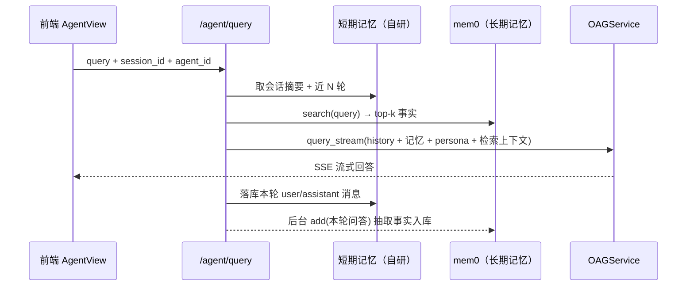

# 智能体会话与记忆 功能设计

| | |
|---|---|
| 版本 | v1（草案） |
| 日期 | 2026-09-13 |
| 状态 | 待评审 |

---

## 1. 背景与问题

当前智能体查询是**无状态单轮**模式：

- `backend/routers/agent.py` 的 `POST /agent/query`（约 605 行）：接收 `AgentQueryRequest`（query / kb_id / skill_ids / agent_id），解析智能体后直接转给 `OAGService.query_stream`，**不接收、也不保存任何历史**；
- `backend/services/oag_service.py` 的 `query_stream(kb_id, query, ...)` 签名中没有 history 参数，每轮 prompt 只含本轮检索上下文；
- 前端 `front/src/components/AgentView.vue` 刷新后对话即丢失，无会话列表；
- `backend/models.py` 中没有会话/消息表（`UserSession` 是登录态表，与对话无关）。

带来的问题：

1. 多轮追问只能靠用户自己把上文复述进提问里；
2. 跨会话的知识（用户偏好、项目事实、已确认的结论）无法沉淀；
3. 长会话没有窗口与压缩策略，未来接入后容易撑爆上下文。

本文档设计**会话（短期记忆）+ 长期记忆**两层能力，回答"记忆有没有、怎么存、怎么压缩"。

---

## 2. 核心概念：记忆 ≠ 上下文管理

先澄清一个容易混淆的点（选型依据）：

| | 上下文管理（Context Management） | 记忆管理（Memory） |
|---|---|---|
| 管什么 | **本会话窗口内**喂给 LLM 的内容：近 N 轮历史、裁剪、压缩摘要、prompt 组装、token 预算 | **跨会话**的事实沉淀：抽取、去重、冲突更新、语义检索 |
| 生命周期 | 会话结束即失效（或归档） | 长期留存 |
| 典型实现 | LangChain `RunnableWithMessageHistory`、LangGraph checkpointer、MemGPT | mem0、Zep（记忆部分） |
| 在本项目 | **自研**：会话表 + 近 N 轮拼接 + 超长摘要（mem0 不负责这部分） | **mem0**：`add()` 抽事实入库，`search()` 取回注入 prompt |

**结论：mem0 是轻量级的长期记忆层（memory layer），不是上下文管理框架。**
"轻量"指它是一个 `pip install mem0ai` 的进程内库，无需独立服务；但它不管对话窗口，短期记忆（会话持久化、多轮拼接、超长压缩）的代码省不掉。

### 2.1 三层记忆总览

```text
┌────────────────────────────────────────────────────┐
│ 工作记忆：本轮 prompt 组装后的完整上下文              │
│   = system 人设 + 长期记忆 + 会话摘要 + 近N轮 + 检索结果 │
├────────────────────────────────────────────────────┤
│ 短期记忆（自研）：chat_session / chat_message        │
│   · 会话持久化、近 N 轮装填、超长滚动摘要             │
├────────────────────────────────────────────────────┤
│ 长期记忆（mem0 + Milvus 独立 collection）            │
│   · 事实抽取 → 合并去重 → 语义检索注入               │
└────────────────────────────────────────────────────┘
```

---

## 3. 短期记忆设计（自研）

### 3.1 数据模型

新增两张表（`backend/models.py`）：

```python
class ChatSession(Base):
    """对话会话：短期记忆的载体。"""
    __tablename__ = "chat_sessions"

    id = Column(String, primary_key=True, default=lambda: uuid.uuid4().hex[:12])
    agent_id = Column(String, default="", index=True)  # 空 = 未引用智能体（纯 KB 问答页）
    kb_id = Column(String, default="", index=True)
    user_id = Column(String, default="", index=True)   # 预留多用户
    title = Column(String(200), default="")            # 默认取首问截断 50 字
    summary = Column(Text, default="")                 # 超长压缩后的滚动摘要（P2）
    created_at = Column(String, default=lambda: datetime.now().isoformat())
    updated_at = Column(String, default=lambda: datetime.now().isoformat())

class ChatMessage(Base):
    """对话消息：user / assistant 逐条落库。"""
    __tablename__ = "chat_messages"

    id = Column(String, primary_key=True, default=lambda: uuid.uuid4().hex[:12])
    session_id = Column(String, nullable=False, index=True)
    role = Column(String, nullable=False)   # "user" | "assistant"
    content = Column(Text, nullable=False)
    meta = Column(Text, default="")         # JSON：引用来源、token 数等
    created_at = Column(String, default=lambda: datetime.now().isoformat())
```

### 3.2 装填策略（近 N 轮 + token 预算）

- 从 `chat_messages` 取该会话**最近 N 轮**（默认 `SESSION_WINDOW_TURNS = 6`，环境变量可配）；
- 或按 token 预算（默认约 2k tokens）**从最新往旧装填**，装不下即截断；
- 拼接为多轮 messages 注入：`OAGService.query_stream` 增加 `history` 参数，插入位置在 persona 之后、本轮检索上下文之前（以实际 prompt 模板为准）。

### 3.3 超长压缩（P2）

会话累计超过阈值（如 20 轮或 8k tokens）时：

1. 把窗口外旧轮次交给 LLM 生成**滚动摘要**（新摘要 = LLM(旧摘要 + 出窗轮次)）；
2. 写回 `chat_sessions.summary`；
3. prompt 结构变为：`人设 + 滚动摘要 + 近 N 轮 + 检索结果`。

> 这一层就是"上下文管理"，**mem0 不提供此能力**，必须自研。

### 3.4 API 扩展

| 接口 | 说明 |
|---|---|
| `AgentQueryRequest` 增加 `session_id`（可空） | 空 = 新建会话；SSE 首个 meta 事件返回 `session_id` / `message_id` |
| `GET /chat/sessions?agent_id=` | 会话列表 |
| `GET /chat/sessions/{id}/messages` | 历史回放（前端刷新恢复） |
| `DELETE /chat/sessions/{id}` | 删除会话（仅删短期记录，不影响长期记忆） |
| `POST /chat/sessions/{id}/rename` | 重命名 |

回答完成后落库本轮 user / assistant 消息（assistant 消息在 SSE 结束回调里写，避免阻塞流）。

---

## 4. 长期记忆设计（mem0）

### 4.1 选型与姿势

| 决策项 | 结论 |
|---|---|
| 部署形态 | OSS 版 pip 库（`mem0ai`），进程内运行，无需独立服务；FastAPI 栈下用 `AsyncMemory` |
| 向量存储 | **复用现有 Milvus 实例**，独立 collection（如 `agent_memories`），与知识库 collection 隔离；embedding 复用全局 `create_embeddings()` |
| 图记忆 | **graph_store 关闭**（不配置即关闭）：本地环境无现成图库，且边际收益有限 |
| 记忆隔离维度 | 以 `agent_id` 作为 mem0 的 `user_id`（每个智能体独立记忆空间），`metadata` 记 `session_id` 便于追溯 |
| LLM | 复用全局 `create_llm()` 对应配置；**抽取/更新 prompt 需针对本地模型调一版**（见 4.4） |
| 代码隔离 | 封装 `MemoryStore` 适配层，业务代码不直接 import mem0（mem0 迭代快，留替换余地） |

### 4.2 写入管线

回答完成后**后台异步**执行（不阻塞 SSE）：

```text
本轮问答 (query + answer)
  → memory.add(messages, user_id=agent_id, metadata={session_id})
      ├─ LLM 调用 1：事实抽取（见第 5 节压缩机制）
      └─ LLM 调用 2：与已有相似记忆比对，判决 ADD / UPDATE / DELETE / NONE
  → 事实写入 Milvus（agent_memories）
```

注意：**每次 add 固定 2 次 LLM 调用**，这是 mem0 的固有成本；轻量指部署形态，不是指 token 开销。降级开关：抽取失败或超时时静默跳过，不影响主链路。

### 4.3 读取管线

请求进入 `/agent/query` 时，`search(query, user_id=agent_id, limit=5)` 取 top-k 事实，
格式化为要点列表，随 persona 一起注入 system prompt：

```text
[长期记忆]
- 用户正在为 XX 系统做技术选型，倾向轻量方案
- 项目向量库为 Milvus，embedding 维度 1024
```

### 4.4 配置示意

```python
from mem0 import AsyncMemory

config = {
    "llm": {"provider": "openai", "config": {  # openai 兼容 / ollama 均可
        "model": ..., "api_base": ..., "temperature": 0.1}},
    "embedder": {...},                          # 复用全局 embeddings
    "vector_store": {"provider": "milvus", "config": {
        "collection_name": "agent_memories", ...}},
    "history_db_path": "./data/mem0_history.db",
    "custom_fact_extraction_prompt": ...,       # 本地模型调优版（4.4 验证）
    "custom_update_memory_prompt": ...,
    # graph_store 不配置 = 关闭
}
memory = AsyncMemory.from_config(config)
```

> 具体配置字段以选定 mem0 版本的 schema 为准，统一收口在 `MemoryStore` 内。

### 4.5 本地模型适配要点

mem0 默认抽取 prompt 面向 GPT-4 级模型，本地小模型常见问题：输出夹带解释文字、漏 JSON、过度抽取。调优方向：

- 明确"只输出 JSON 列表、每条为一句陈述事实"；
- 限制抽取数量（如 ≤5 条/轮），过滤寒暄与重复；
- 离线用 10 组典型对话做回归样例，对比抽取质量。

---

## 5. mem0 如何做"上下文压缩"（重点）

mem0 的压缩**不是传统的窗口裁剪（trimming）**，而是"**存事实、不存原文；检索注入、不全量回放**"。压缩发生在三个环节：

### 5.1 写入时：抽取式压缩（最核心）

`add(messages)` 收到原始对话后，LLM 抽取少量**离散事实（facts）**——通常是主谓宾式的第一人称短句：

```text
原始对话（10 轮，~3000 tokens）
  ├ 用户：我们项目用的向量库是 Milvus，embedding 维度 1024……
  ├ 助手：了解，1024 维建议用 HNSW 索引……
  └ ……（8 轮追问）
        ↓ 抽取
记忆条目（2 条，~60 tokens）
  ├ "用户的向量库是 Milvus"
  └ "用户的 embedding 维度是 1024"
```

**原始 transcript 不落库，只有事实条目持久化**——这是结构性压缩，10:1 以上的 token 收益在长对话中很常见。

### 5.2 更新时：合并式压缩（防膨胀）

每条候选事实先向量检索相似旧记忆，再由 LLM 判决四种操作之一：

| 判决 | 行为 | 压缩效果 |
|---|---|---|
| ADD | 新增 | — |
| UPDATE | 用新事实改写旧记忆 | 同主题不重复堆积 |
| DELETE | 旧记忆已失效（如"迁移到 Qdrant 了"） | 淘汰过期信息 |
| NONE | 与旧记忆重复/无价值 | 丢弃 |

记忆条目数**不随对话轮数线性增长**——同类信息反复出现只会更新一条，而不是插入 N 条。

### 5.3 读取时：检索式压缩

注入 prompt 的不是全部记忆，而是 `search(query)` 语义检索出的 **top-k（默认 5 条左右）**相关事实。上下文占用恒定，不随记忆总量增长。

### 5.4 可选增强：图记忆（默认关闭）

mem0^g 变体把事实进一步组织为实体-关系三元组图，结构化压缩更强，但需要图存储且复杂度高——本项目一期不启用。

### 5.5 收益参考

Mem0 论文（arXiv:2504.19413）报告口径：对比"全量历史塞上下文"（LOCOMO 基准约 26k tokens/问），mem0 平均约 1.4k tokens/问，**token 节省约 90%，p95 延迟降低约 91%**，准确率损失很小（相对 OpenAI 内置记忆功能提升约 26%）。

### 5.6 边界（再次强调）

mem0 只做**跨会话事实层**的压缩；**会话内窗口管理**（近 N 轮装填、超窗滚动摘要）不在其职责内，由第 3 节的短期记忆层自研。两层压缩叠加，工作记忆才能稳定在预算内。

---

## 6. 端到端流程



---

## 7. 分期落地

| 阶段 | 内容 | 依赖 |
|---|---|---|
| P1 会话与多轮 | 两张表 + `session_id` 贯通前后端 + 近 N 轮拼接 + 会话列表/回放 API | 无 |
| P2 超长压缩 | 滚动摘要 + token 预算装填 | P1 |
| P3 长期记忆 | 引入 mem0ai、MemoryStore 适配层、注入与后台写入、本地模型抽取 prompt 调优 | P1 |

---

## 8. 风险与待决策项

1. **mem0 写入延迟**：每轮 2 次 LLM 调用 → 已定后台异步 + 失败静默；后续可评估按会话批量写入。
2. **本地小模型抽取质量**：prompt 调优 + 回归样例；效果不达标时保留整体降级开关（长期记忆可独立关闭）。
3. **记忆隔离粒度**：一期按 agent_id 隔离；多用户上线后需决定是否叠加 user_id 维度（表结构已预留）。
4. **删除语义**：删会话不删长期记忆；如需"被遗忘权"，在 MemoryStore 上提供按 session_id metadata 清除的入口。
5. **mem0 版本迭代快**：API 变动风险由 `MemoryStore` 适配层吸收，锁定 `mem0ai` 版本号。
