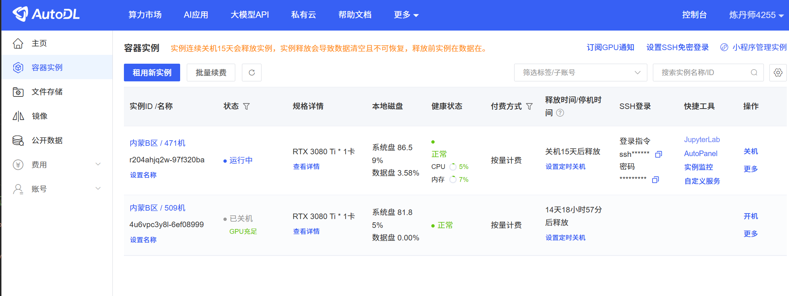
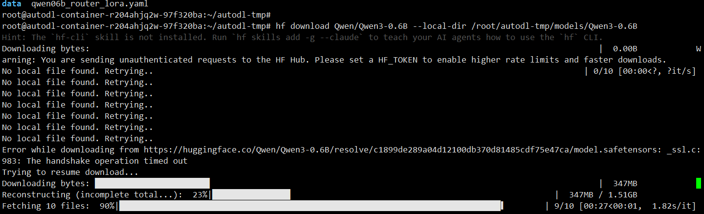
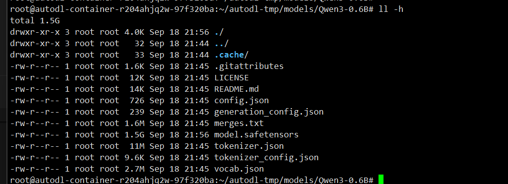
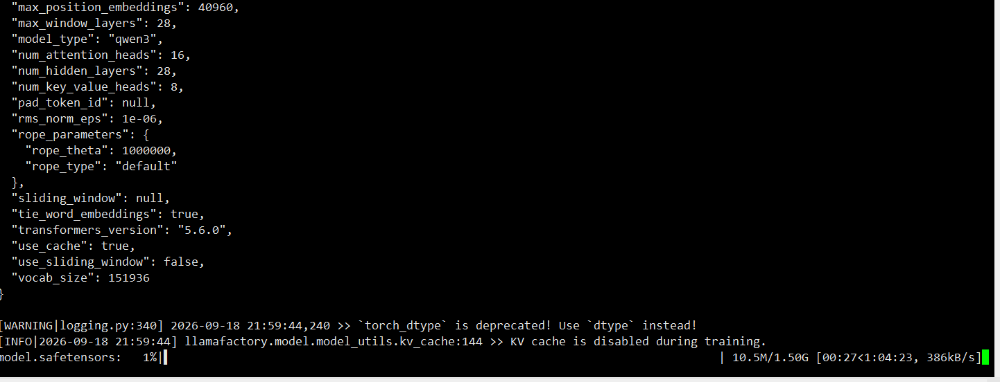
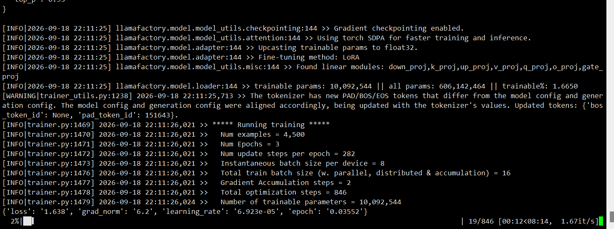
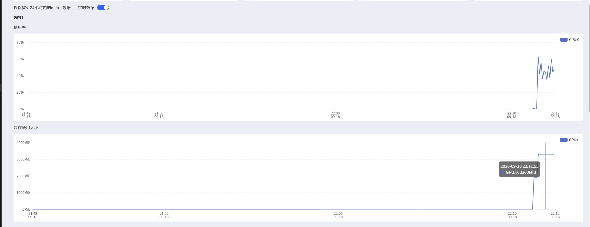
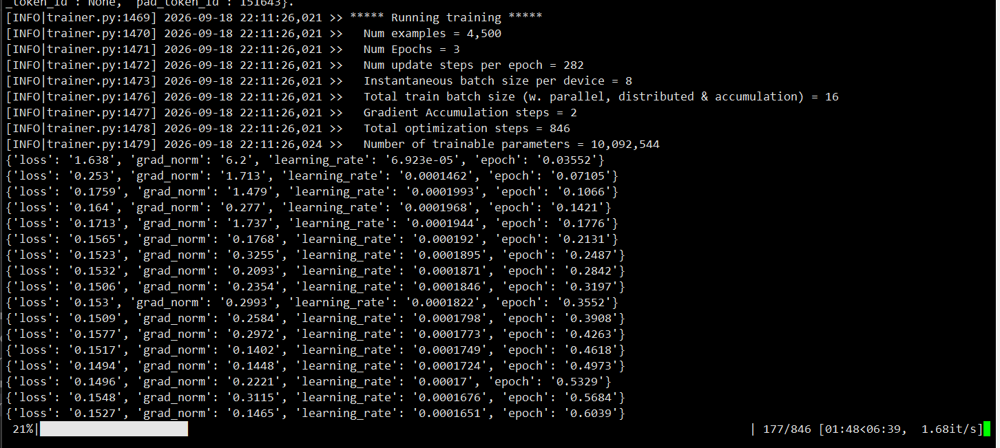
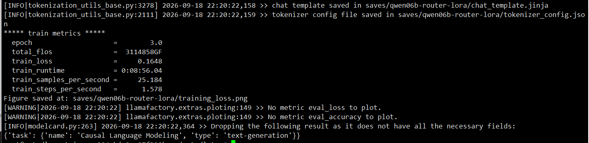
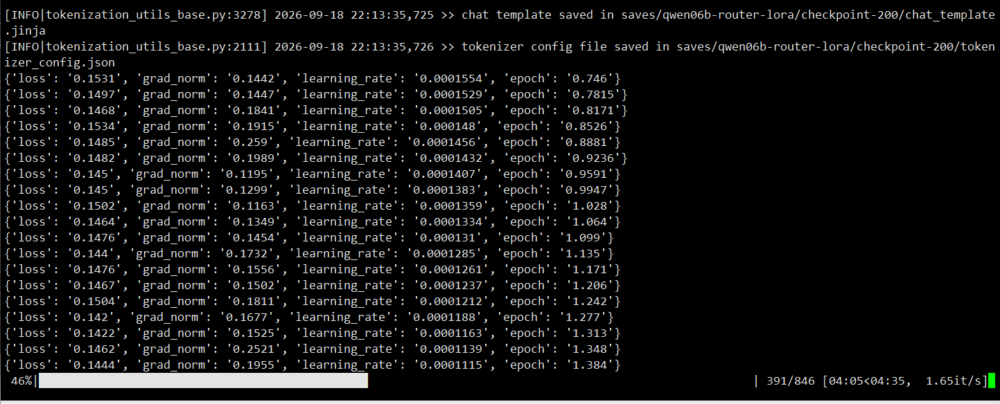
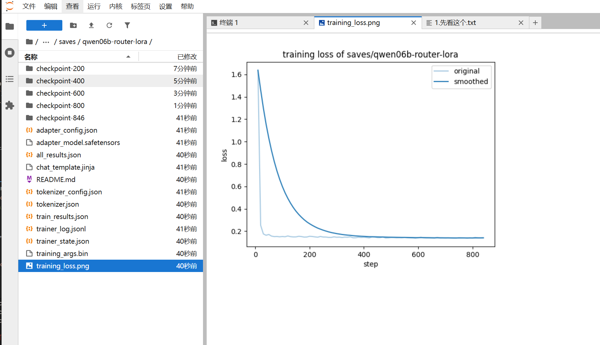

# 意图路由模型微调训练与部署手册（Qwen3-0.6B · LoRA）

> 配套《模型微调总体设计.md》。只覆盖 **1 个模型**：
> **查询意图路由**（Qwen3-0.6B + LoRA，LLaMA-Factory，SFT 指令监督）。
> 训练在 AutoDL 云 GPU 上进行（本机显卡低，只承担推理部署），产物 scp 拷回本机接入平台。

---

## 0. 全流程一览（LoRA 微调 7 步，先建立全局感）

```
① 租卡装环境      AutoDL 租 4090 + 装 LLaMA-Factory            （§1，一次性 ~10 分钟）
② 造数据          SFT 三元组 JSON → 上传实例 + 注册 dataset_info（§2）
③ 写训练 yaml     LoRA 配置一份（r=16, alpha=32, target all）    （§3.1）
④ 训练            llamafactory-cli train → 盯 loss 曲线         （§3.1）
⑤ 合并导出        llamafactory-cli export → 独立完整模型         （§3.1）
⑥ 下载部署        scp 回本机 → ollama Q4 量化 / 进程内直推       （§4）
⑦ 接入验收        query_router.py + 300 条验证集评测             （§5/§6）
```

LoRA 流程与全参微调的流程差异只在 ③④⑤：多一份 LoRA 配置、显存占用小一个量级、
训练产物是 adapter（几十 MB）需要合并导出才能独立部署——其余步骤完全一致。

---

## 1. AutoDL 训练环境（从租卡到产出）

> 控制台：https://autodl.com/console/homepage/personal →「我的实例」→「租用新实例」。

### 1.1 租实例

1. **计费方式**：按量计费（用完关机即停止计费，精确到秒）；
2. **GPU**：RTX 4090 24G 档即可（0.6B LoRA 单卡富余；4090 缺货时 3090/A5000 亦可），买了个3080Ti 12G的；
3. **镜像**：选官方 `PyTorch 2.x + Python 3.11 + CUDA 12.x` 基础镜像（也可在
   社区镜像直接搜「LLaMA-Factory」省去安装）；
4. **数据盘**：默认 50G 足够（模型权重 + 数据集 <5G）。



```
~# nvidia-smi
Fri Sep 18 16:18:24 2026       
+-----------------------------------------------------------------------------------------+
| NVIDIA-SMI 595.71.05              Driver Version: 595.71.05      CUDA Version: 13.2     |
+-----------------------------------------+------------------------+----------------------+
| GPU  Name                 Persistence-M | Bus-Id          Disp.A | Volatile Uncorr. ECC |
| Fan  Temp   Perf          Pwr:Usage/Cap |           Memory-Usage | GPU-Util  Compute M. |
|                                         |                        |               MIG M. |
|=========================================+========================+======================|
|   0  NVIDIA GeForce RTX 3080 Ti     On  |   00000000:41:00.0 Off |                  N/A |
| 30%   29C    P8             17W /  350W |       1MiB /  12288MiB |      0%      Default |
|                                         |                        |                  N/A |
+-----------------------------------------+------------------------+----------------------+

+-----------------------------------------------------------------------------------------+
| Processes:                                                                              |
|  GPU   GI   CI              PID   Type   Process name                        GPU Memory |
|        ID   ID                                                               Usage      |
|=========================================================================================|
|  No running processes found                                                             |
+-----------------------------------------------------------------------------------------+
```

### 1.2 连接与加速

```bash
# 控制台复制 SSH 登录指令（格式如下，端口/地址以自己实例为准）
ssh -p 39678 root@connect.nmb2.seetacloud.com
# 或直接用 JupyterLab（控制台「JupyterLab」按钮 → 终端），推荐 VSCode Remote-SSH 远程开发

# 学术加速（访问 GitHub/HuggingFace 等资源前执行）
source /etc/network_turbo

# HuggingFace 下载走国内镜像（下载 Qwen3-0.6B 基座用）
export HF_ENDPOINT=https://hf-mirror.com

# 必须禁用 Xet 下载协议：新版 huggingface_hub 默认启用 Xet，但 hf-mirror 镜像不支持其
# CAS 鉴权，下载大文件（tokenizer.json/模型权重）会报 401 Unauthorized
# （cas-server.xethub.hf.co）。小文件正常、大文件挂起即是此坑。也可 pip uninstall -y hf_xet 一劳永逸
export HF_HUB_DISABLE_XET=1
```

### 1.3 训练环境安装（实例内）

```bash
# 一次性装好（torch/torchaudio 钉到与 CUDA 12.8 镜像一致的 cu128 构建，llamafactory 走 PyPI）
# 关键：torch 与 torchaudio 小版本号一致、CUDA 后缀一致，否则 LLaMA-Factory 导入 torchaudio
# 会 OSError: libcudart.so.13。若镜像 CUDA 版本不同，把两处 cu128 换成对应构建（cu124/cu126/cu130），
# 以 `python -c "import torch; print(torch.version.cuda)"` 输出为准。
pip install "torch==2.7.0+cu128" "torchaudio==2.7.0+cu128" llamafactory \
  --index-url https://download.pytorch.org/whl/cu128 \
  --extra-index-url https://pypi.org/simple
llamafactory-cli train --help        # 验证安装成功（应直接打印帮助，不报 libcudart.so.13）
python -c "import torch; print(torch.__version__, torch.cuda.is_available())"   # 应输出 True；False 说明 torch 被动过，重装 CUDA 版
```

### 1.4 计费与数据保留（重要）

- 实例「运行中」才计费，**训练完及时关机**（关机不计费，数据保留）；
- **连续关机 15 天实例会被释放**——产物务必当次下载回本机并另存一份网盘；
- 数据准备/调试可用「无卡模式」开机（约 ¥0.1/小时级），训练再切有卡。

本机（Windows）仅部署推理：低配推荐装
[ollama](https://ollama.com)（`winget install Ollama.Ollama`，默认 `http://127.0.0.1:11434`）。

---

## 2. 训练数据构造与上传（本机 Windows 侧，先于训练完成）

### 2.1 数据格式与构造

> 造数据不依赖 GPU 实例，可与 §1 环境准备并行；数据没造好不用急着执行 §2.2 上传。

统一 SFT 格式（LLaMA-Factory alpaca 风格，`doc/模型微调/finetune/data/ontology_router.json`）：

```json
{"instruction": "判断用户查询的意图类别，从 kb(知识库)/graph(图谱)/data(台账数据)/chat(寒暄杂询) 中选择，输出 JSON：{\"labels\":[],\"confidence\":0.0}", "input": "今天 MU5307 航班正常率怎么样", "output": "{\"labels\":[\"data\"],\"confidence\":0.92}"}
```

- 种子：现网 query（`chat_messages` 用户消息）人工标注 300~500 条
  （按 DataAgent 命中史/图谱命中史辅助粗标）；
- 扩造：台账词表模板（正常率、延误、滑回…）、图谱词表模板（关联、上下游、涉及哪些…）、
  寒暄模板各扩 200~500 条；
- data 类正样本可直接复用词频强信号（`DATA_STRONG`）命中记录；
- 目标量：合计 3000~5000 条；校验脚本确保 output 均为合法 JSON；
  已由 `gen_router_dataset.py` 模板扩造生成 **5000 条**（train 4500 + 留出 eval 500，
  data 39% / graph 24% / kb 20% / chat 11% / 多标签 6%，含边界难例，seed 固定可复现）；
- 留出 10% 作验证集（另存 `ontology_router_eval.json`，训练时不参与，仅评测用）；
- **注意**：训练 instruction 必须与线上 `query_router.py` 的 `ROUTER_PROMPT` 逐字一致。

数据集注册（`doc/模型微调/finetune/data/dataset_info.json`，LLaMA-Factory 靠它找到数据）：

```json
{
  "ontology_router": {
    "file_name": "ontology_router.json",
    "columns": {
      "prompt": "instruction",
      "query": "input",
      "response": "output"
    }
  }
}
```

### 2.2 数据上传（构造完成后执行；产物下载见 §3.1）

```bash
# 上传（本机 Windows 执行，cd 到本手册所在目录 doc\模型微调\——即 ./finetune/ 所在目录）
# 实例上先建好远程目录（scp 不会自动创建）：mkdir -p /root/autodl-tmp/data
scp -rP 39678 ./finetune/data/ontology_router.json ./finetune/data/ontology_router_eval.json root@connect.nmb2.seetacloud.com:/root/autodl-tmp/data/
scp -rP 39678 ./finetune/data/dataset_info.json root@connect.nmb2.seetacloud.com:/root/autodl-tmp/data/
scp -rP 39678 ./finetune/qwen06b_router_lora.yaml root@connect.nmb2.seetacloud.com:/root/autodl-tmp/

# 训练产物（合并模型）的下载命令在 §3.1 合并导出完成后执行——按训练时序走，不在本阶段下载
```

---

## 3. LoRA 训练（LLaMA-Factory）

> 方案选型依据（为什么选 LoRA / Qwen3-0.6B）与方法原理（SFT / LoRA / QLoRA / Qwen3 坑）
> 见《微调方法体系.md》§6「本项目落地」，本节只给可执行的训练与导出步骤。

### 3.1 训练实操（yaml → 训练 → 合并导出）

`qwen06b_router_lora.yaml`：

```yaml
# HF repo id（训练时自动在线下载）或本地目录二选一；
# 若已用 huggingface-cli 预下载到本地，改成本地路径如 /root/autodl-tmp/models/Qwen3-0.6B
model_name_or_path: Qwen/Qwen3-0.6B
stage: sft
do_train: true
finetuning_type: lora
lora_rank: 16
lora_alpha: 32
lora_dropout: 0.05
lora_target: all
dataset: ontology_router
template: qwen3
cutoff_len: 1024
max_samples: 100000
learning_rate: 2.0e-4
num_train_epochs: 3
per_device_train_batch_size: 8
gradient_accumulation_steps: 2
warmup_ratio: 0.03
logging_steps: 10 #每10步打印一次loss
save_steps: 200
output_dir: saves/qwen06b-router-lora
plot_loss: true
```

```bash
source /etc/network_turbo    # 拉基座权重前先加速（Qwen3-0.6B 约 1.5G）
# 推荐先把基座完整预下载到本地（HF_HUB_DISABLE_XET=1 见 §1.2，走普通 HTTP 防中断），
# 下载完把上面 yaml 的 model_name_or_path 改成本地路径——训练过程即完全离线
# 注意：新版 huggingface_hub 的 CLI 已改名 hf（旧名 huggingface-cli 已废弃不可用），参数不变
hf download Qwen/Qwen3-0.6B --local-dir /root/autodl-tmp/models/Qwen3-0.6B

# 开始训练
llamafactory-cli train qwen06b_router_lora.yaml
# 4090 24G 上 0.6B LoRA 显存富余（<6G），无需 QLoRA；换小卡才考虑 quantization_bit: 4
# 1000~2000 条数据 epoch 3 约几分钟~十几分钟；saves/ 下出 adapter（几十 MB）+ loss 曲线图
```
下载模型中

下载完毕

加载模型权重到内存

开始训练



训练完毕


**盯 loss**：`plot_loss: true` 会在 output_dir 生成 train loss 曲线——
正常形态是前几百步快速下降后趋平；曲线回升/震荡不降即过拟合信号，
先减 epoch 或加数据，别急着调 rank（本任务验证集不参与训练、训练中无 eval loss，
过拟合最终以 §6 留出验证集评测为准）。



**合并导出**（adapter → 独立完整模型，便于下载回本机部署）：

```bash
llamafactory-cli export --model_name_or_path Qwen/Qwen3-0.6B \
  --adapter_name_or_path saves/qwen06b-router-lora \
  --export_dir /root/autodl-tmp/models/qwen06b-router-merged --export_size 2
# 产物：完整权重目录（safetensors + tokenizer 配置）
```

> **合并是干啥的**：LoRA 训练产物 `adapter_model.safetensors` 只有几十 MB，存的不是模型
> 而是**增量补丁**（低秩矩阵 B、A），推理时真实权重为 W' = W基座 + BA——
> 补丁离开基座（Qwen3-0.6B）无法独立使用。合并就是提前把这步加法算完，
> 导出结构与基座一致的完整权重目录（约 1.5G），但行为已是微调后的路由模型。
>
> | 方式 | 说明 | 适用 |
> |---|---|---|
> | 合并导出（本手册） | 标准模型目录，任何推理框架直接加载 | ollama / vLLM 部署、下载回本机 |
> | 运行时挂 adapter | 同时加载基座 + adapter（需 peft/LLaMA-Factory 环境） | 一个基座挂多套 adapter 做 A/B |
>
> ollama / vLLM 只认完整权重、不认识 LoRA adapter，所以部署前必须合并；
> 代价是产物从几十 MB 变回 1.5G——故导出完立即执行下方 scp 下载。

**下载产物回本机**（合并导出完成后立即执行，勿只留实例上；在本机 `doc\模型微调\` 目录执行）：

```bash
scp -rP 39678 root@connect.nmb2.seetacloud.com:/root/autodl-tmp/models/qwen06b-router-merged ./
```

把训练结果下载
```bash
scp -rP 39678 root@connect.nmb2.seetacloud.com:/root/autodl-tmp/saves ./
```

验收标准：留出 10% 验证集，loss 平稳不反弹；任务级验收见 §6。

---

## 4. 本机部署（产物来自 §2.2 scp 下载）

### 4.1 方案 B（低配推荐）：ollama 加载并量化

```powershell
winget install Ollama.Ollama      # 本机一次安装（已装跳过）

# 【为什么要转 GGUF】ollama 的 safetensors 转换器只预置了部分主流架构的解析逻辑，
# Qwen3ForCausalLM 直接导入会报 unsupported architecture（实测 0.34.0 仍如此，与版本无关）。
# 标准解法：先用 llama.cpp 的 convert_hf_to_gguf.py 转成 GGUF，再从 GGUF 导入。
#   clone 慢可给 git 配本机代理（端口按实际改），用完记得 --unset：
git config --global http.https://github.com.proxy http://127.0.0.1:7898
git clone --depth 1 https://github.com/ggml-org/llama.cpp D:\tools\llama.cpp

conda activate ontology           # PowerShell 5.1 不支持 &&，须分条执行
pip install gguf sentencepiece    # sentencepiece 是词表检测依赖，缺了 convert 时报 ModuleNotFoundError；
#   依赖装不全时一步到位：pip install -r D:\tools\llama.cpp\requirements.txt
cd doc\模型微调\qwen06b-router-merged
# PowerShell 没有 bash 的 \ 续行符，convert 命令务必单行执行：
python D:\tools\llama.cpp\convert_hf_to_gguf.py .\qwen06b-router-merged --outfile .\qwen06b-router-f16.gguf --outtype f16   # 0.6B 产出约 1.2G（含 tokenizer）

# Modelfile 无需手写：llamafactory export 自动生成（TEMPLATE + stop + temperature 0），
# 只需把 FROM 改为指向 GGUF（已改好）；TEMPLATE/stop/temperature 必须保留——
# GGUF 导入时 ollama 读不到 HF 的 chat template，全靠 Modelfile 里这几行。
# 注意 FROM 是 ../：GGUF 落在上一级 doc\模型微调\（convert 时 CWD），写成 ./ 会报 not in GGUF format
cd qwen06b-router-merged
ollama create --quantize q4_K_M qwen06b-router -f Modelfile   # f16 → Q4 约 0.5G；GGUF 导入不自动量化，须显式指定
ollama run qwen06b-router --think=false "判断意图：今天航班正常率怎么样"   # Qwen3 必须关思考
# OpenAI 兼容端点：http://127.0.0.1:11434/v1（api_key 任意非空值），复用平台 build_llm 接入
# 生产环境换 vLLM：vllm serve models/qwen06b-router-merged --port 8000，同协议
```

### 4.2 方案 A（备选）：进程内直推

合并导出目录放后端约定路径，进程内懒加载
（有 GPU 用 GPU；纯 CPU 单次约 1~3 秒，路由非实时关键路径可接受）：

```bash
# 产物已下载到本机 doc\模型微调\ 下（§2.2 scp 直接落在执行目录）
cd doc\模型微调
cp -r qwen06b-router-merged  ../../backend/data/models/query-router
```

---

## 5. 平台接入（query_router.py）

按 §4 选定的部署形态接入：**方案 B（ollama，低配推荐）**——新增 `services/query_router.py`
内用 `build_llm(base_url="http://127.0.0.1:11434/v1", model="qwen06b-router")` 构造路由专用 LLM
（`ROUTER_PROMPT` 末尾加 `/no_think` 软开关，防 Qwen3 思考模式拖慢并污染 JSON 输出），
`classify()` 改为一次 `ainvoke` + JSON 解析即可，无需 transformers 加载；
**方案 A（进程内直推）**——按下方骨架实现：

`services/query_router.py`（骨架，方案 A）：

```python
from functools import lru_cache
from config import settings

@lru_cache(maxsize=1)
def _load():
    from transformers import AutoModelForCausalLM, AutoTokenizer
    tok = AutoTokenizer.from_pretrained(settings.ROUTER_MODEL_PATH)
    mdl = AutoModelForCausalLM.from_pretrained(settings.ROUTER_MODEL_PATH, torch_dtype="auto")
    return tok, mdl

async def classify(query: str) -> dict:
    """返回 {"labels": [...], "confidence": float}；任何异常返回 None（调用方走全编制）。"""
    if not settings.ROUTER_ENABLED:
        return None
    try:
        tok, mdl = _load()
        prompt = ROUTER_PROMPT.format(query=query)          # 与 §2 训练 instruction 一致
        ids = tok.apply_chat_template(                      # 必须走 qwen3 chat 模板，与训练一致
            [{"role": "user", "content": prompt}],
            tokenize=True, add_generation_prompt=True,
            enable_thinking=False,                          # Qwen3 关思考，保低延迟与纯 JSON
            return_tensors="pt")
        out = mdl.generate(**ids, max_new_tokens=64, do_sample=False)
        return _parse_json(tok.decode(out[0][ids.input_ids.shape[1]:], skip_special_tokens=True))
    except Exception:
        return None   # 永不阻塞主流程
```

`config.py` 追加：

```python
ROUTER_ENABLED: bool = False
ROUTER_MODEL_PATH: str = "./data/models/query-router"
```

接入点（多智能体入口拿到 `query` 后先 `classify()`）：
- `chat` → 主大模型直答，不编排；
- 单标签 → 只勾选对应能力智能体进 Planner 输入（编制瘦身）；
- `None` / 低置信度 → 走现状全编制（兜底）；
- **边界**：路由之后 Planner / Worker / ToolAgent / Synthesizer 的模型选择不变，
  仍全部走 `create_llm()` 主大模型——路由只决定"要不要编排、编排谁"。

回退：`ROUTER_ENABLED=false` 即恢复现状。

---

## 6. 评测与验收

| 模型 | 验收集 | 指标 | 达标线 |
|---|---|---|---|
| 意图路由 | 300 条人工标注 | 4 分类准确率 / 漏判率 | 准确率 ≥92%，data 类漏判 <5%（漏判走全编制兜底） |
| 意图路由 | 300 条人工标注 | 4 分类准确率 / 漏判率 | 准确率 ≥92%，data 类漏判 <5%（漏判走全编制兜底） |

评测不达标先查数据质量（蒸馏标签噪声、标注口径不一致），再考虑加 epoch/rank；
仍不达标则保持现状（无路由），开关关闭即可，不影响现有链路。

---

## 7. 目录约定

```
backend/data/models/query-router     # 路由模型（进程内直推时，.gitignore，路径可配）
models/qwen06b-router-merged         # 路由模型合并导出（AutoDL 产物，ollama/直推共用）
doc/模型微调/                         # 设计文档 + 训练工程（finetune/ 本机保存，上传 AutoDL 用）
doc/模型微调/finetune/data/ontology_router.json   # SFT 训练数据（意图路由）
doc/模型微调/finetune/data/ontology_router_eval.json  # 留出验证集（不参与训练，仅 §6 评测用）
doc/模型微调/finetune/data/dataset_info.json      # LLaMA-Factory 数据集注册
doc/模型微调/finetune/qwen06b_router_lora.yaml    # LoRA 训练配置
doc/模型微调/训练数据集/              # 数据集生成工程（路由 gen_router_dataset.py + 告警 gen_alarm_dataset.py）
```

> AutoDL 实例只作临时算力：产物（合并模型 + LoRA adapter）经 §2.2 下载回本机后即可关机；
> 实例连续关机 15 天会释放，`models/` 与 `doc/模型微调/finetune/` 在本机各留一份（或网盘备份）即不受影响；
> 需要复现时在本机重训也可以——0.6B LoRA 对显卡要求极低，数据 + yaml 齐全即可随时重来。
